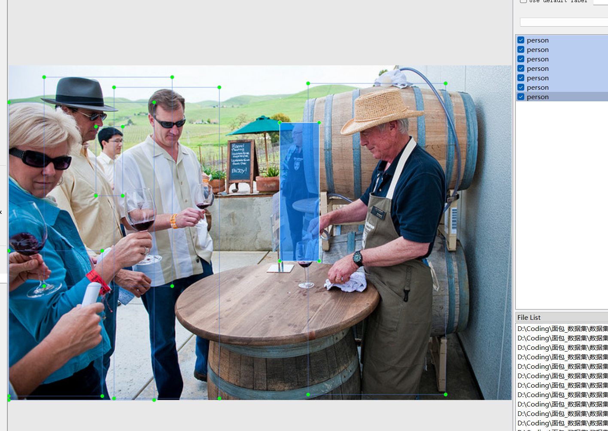

# Pedestrian Detection - Target Detection Dataset

Dataset Information Introduction: There are a total of 72,681 images and corresponding annotation files.
Annotation file formats include XML files in VOC format and TXT files in YOLO format.
The annotated objects include the following:
['person']
The number of bounding box information is as follows: (Annotations are typically labeled in English, with Chinese provided as a reference inside parentheses)
person: 283,267 (people)
Note: One image may be annotated with multiple objects, so the total number of bounding boxes might be greater than the number of images.
Complete dataset consists of three folders and one txt file:
all_images folder: Stores the dataset's images, screenshot included:
Image size information:
all_txt folder and classes.txt: Stores the TXT annotation files in YOLO format, the number matches the number of images, each annotation file corresponds to an image.
classes.txt:
For a detailed understanding of the standard YOLO format, please search for it yourself on Baidu. Simply put, Object 0 refers to the name at index 0 in the array in classes.txt.
all_xml folder: VOC format XML annotation files.
The number matches the number of images, each annotation file corresponds to an image.
For a detailed understanding of the standard VOC format, please search for it yourself on Baidu.
Both formats can be used, choose one according to your preference.
Annotation effect screenshots:

## Images

Here is a pay link on Stripe ( https://buy.stripe.com/3cs8yP7sY87d0vu9AB ). Please contact me lonlonago@foxmail.com after funding $89, and I will send you a complete data files , thank you!

